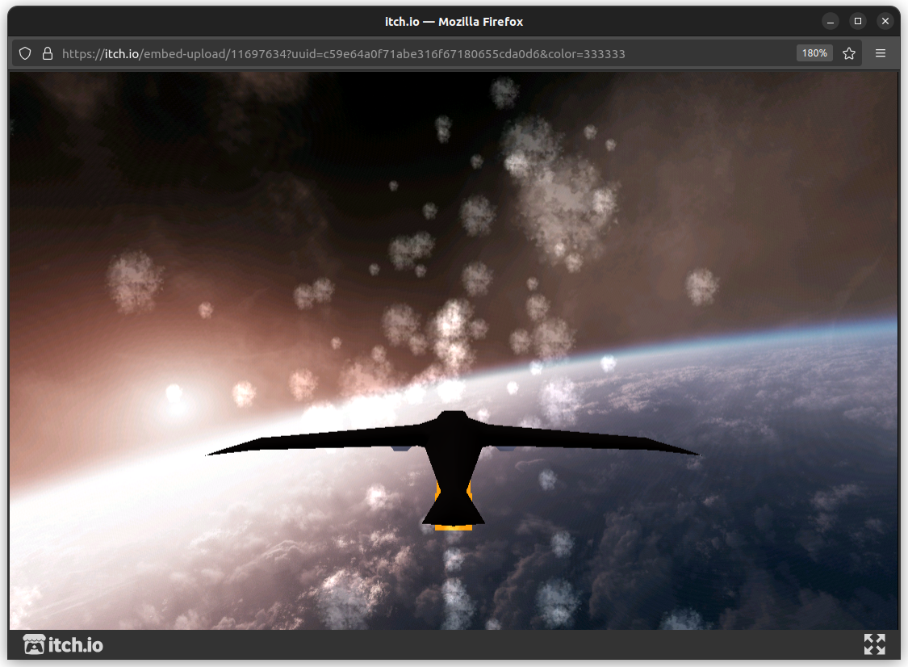
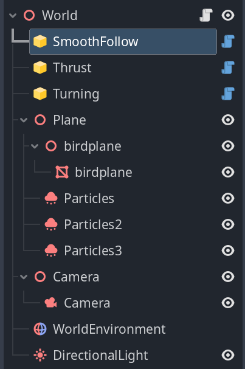
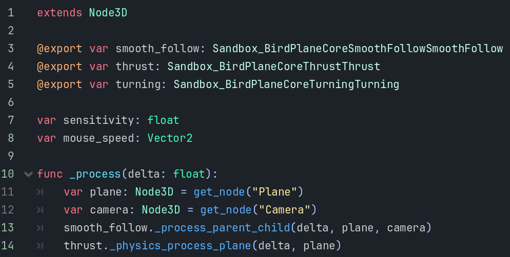
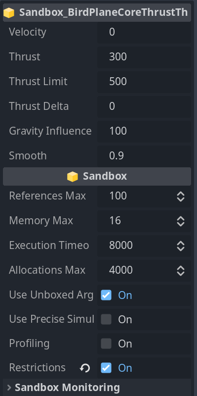

# Introduction



The [Godot Sandbox bird demo](https://gonzerelli.itch.io/bird-demo) showcases how to create controllable entities with custom properties and other features that makes Godot Sandbox integrate really well as if it was a scripting language. You can find the [repository here](https://github.com/V-Sekai-fire/godot_bird_plane).


The demo project showcases auto-completion in GDScript.


Godot Sandbox exposes access to all things Godot inside the protected sandbox programs, as well as a selection of godot-cpp-only features.



The scene has 3 sandbox programs each of which controls one aspect of the game.



Everything is controlled from a GDScript that handles `_process`.


Restrictions have been enabled, and we have to allow some methods. Recording the actual methods used would allow restricting it even more, however that is more useful when everything is closer to the finish line. There are many other types of restrictions not shown here, such as the ability to instantiate objects from classes.



Sandbox programs can expose their own properties that can be tweaked in the editor. Below that is the regular Sandbox properties that change the behavior and restrictions of the program running inside.


Sandbox programs are compiled from regular programming languages, which allows them to support an enormous amount of existing software. The image shows that LuaJit has been embedded into a program which is running in the browser. It also has binary translation enabled, giving it near-native performance.

## Introduction

Godot Sandbox is serious software. Knowledge about build systems, cross-compiler toolchains and deep knowledge about C++ is a plus. Godot Sandbox does not have a design goal of being zero upfront effort. It's main goal is to provide high-performance safely-sandboxed functionality to games intended for an audience, and it does so by providing all the tools needed for a wide variety of needs. In order to provide those guarantees we need to completely separate untrusted software from the main game, and that can only be achieved through proper sandboxing. Mod loaders, PCK-scanning and other high-convenience low-effort solutions will have a hard time giving those same guarantees, as untrusted scripts are often involved and access to general Godot classes is expected. Without scripts one can only add cosmetics to a game, sometimes not even that. With scripts one can extend the game with new and interesting game mechanics.

Modern games with open modding struggle with malware and security holes, especially C# and Java games where unrestricted access to your computer is the status quo, and would do better if they were sandboxed from the start. It's a classic tradeoff between accessibility and safety. The games that are doing it right will have security issues every now and then, too. The difference is that when they fix those issues, they are again safe. As an example, the effort required to create a real exploit for Factorio was a long and laborious process relying on a bug in unused bytecode handling. Once fixed, finding the next one could take a long time. Finally, sandboxed modding APIs are harder to use, but are just as popular. If people like your game, there will be people making mods for it.

Godot Sandbox is not just a sandbox, though. It also provides access to higher performance computation than GDScript, similar to extensions. The difference is that Godot Sandbox programs are built once, and then proceeds to run on every platform. If you build a sandbox program today and export to Web, VR, mobile and console you will see it works exactly the same as on desktop. If you embed high-performance binary translations of the program into your game, exporting it to Web, VR, mobile and console will automatically see that high-performance too. So, one could use Godot Sandbox without restrictions enabled just for the ability to easily support all of Godots platforms.

Since these programs can be loaded at run-time it's also possible to publish a game and then provide updates to the game through sandbox programs, avoiding the publishing process thereafter.

## Restrictive

Godot Sandbox is a tools-not-policies approach to sandboxing. It gives you everything you need to successfully sandbox anything, with potentially access to everything that GDScript also has access to.

:::note

The Sandbox is by default completely open, allowing you access to everything. This is intentional for development.

:::

After enabling restrictions, the Sandbox fully closes, and will only allow access to exactly what you specify through Callables.


:::warning

Changing restrictions is disabled if the Sandbox is in the middle of a call. This is a security feature, so that changing restrictions even indirectly is impossible.

:::

If you need to change restrictions during a Sandbox call, wait until the call is finished and then change them. Or the next frame.


## Low-latency

A major design goal is having the lowest latency between the Sandbox and the Godot engine. As a result, calling functions, and in general, communication forth with the Godot engine is fairly fast. Often an order of magnitude faster than other sandboxing solutions.

As an example, to check if we are currently in the editor, we have to have ask Godot for `Engine::is_editor_hint()`. If the cost to leave the VM to ask for this is ~90ns then we have to ask ourselves if we shouldn't cache that value inside the VM instead, to avoid the overhead of having to ask. However, with _libriscv_ the system call overhead is ~2ns, and so asking Godot directly always makes sense. Check out the [latency benchmarks page](/benchmarks/latency.md). You will see that Godot Sandbox is lower-latency and faster than even GDScript, which is not sandboxed.

## Maximum portability

The Sandbox has implemented support for the C++ and Rust system languages currently. The extension supports all of Godots platforms, including future platforms like RISC-V, Loongarch, Switch 2, Quest 3 and any other platform where one would be able to compile standard C++ with no dependencies.

Anyone can implement support for new languages, as long as those languages transpile to C or C++, or can emit RISC-V directly.

## Full API access

The Sandbox has access to the entire public Godot API using a run-time generated API. The run-time generated API is written into the project root, or wherever CMakeLists.txt is if you are using CMake. Then, when building a program, the API will be discovered by the build system, and your external editor if you are using that, and provide the entire API.

This run-time generated API also includes loaded extensions your project is using. That means if you are using a GDExtension that creates new classes, those are also available in Godot Sandbox, with auto-completion.

## Temporary Arguments

The Sandbox is designed to be safe and is therefore sometimes forgetful.

When you pass arguments to the Sandbox, arguments by reference will only be remembered until the function call ends. After the function completes, these temporary Variants are forgotten. This design avoids all kinds of scary lifetime issues.

Data can be remembered by passing arrays or dictionaries to and from the VMs. The VMs can also store their own data in their native language formats. What the VM forgets is only related to complex Variant arguments. For example, you can remember a Variant `Vector2` but not a Variant `String`. You can convert the `String` to a `std::string` and store that instead.

Further, any Variant created during initialization is permanent:

```cpp
// This works: it's being created during initialization
static Dictionary d = Dictionary::Create();

extern "C" Variant test_static_storage(Variant key, Variant val) {
	d[key] = val;
	return d;
}
extern "C" Variant test_failing_static_storage(Variant key, Variant val) {
	// This won't work twice: it's being created only once
	static Dictionary fd = Dictionary::Create();
	fd[key] = val;
	return fd;
}
```

## Runs only when needed

The Sandbox only runs when there is a function call to execute. If you are not calling a function in the Sandbox, then *it is not running*.

## Thread unsafe

Parallelism is possible, but make sure you are only calling into an instance from one thread at a time. The easiest way to avoid trouble is to have one instance per thread. Instances are tiny and share all executable (and binary translation) memory, which is often the largest part of the programs.

## Passing is permitting

If you pass an object to the VM, the VM will allow the sandboxed program to use it. Ordinarily, an object or node has to be retrieved using regular operations like `get_node()`. Many objects are also forbidden or out of reach. Passing an object as an argument to a function, will allow it to be used.

Examples:

- Passing a dictionary containing the OS singleton *DOES NOT* automatically give access to OS. Every item in the dictionary has to go through the restrictions filter. Only the dictionary itself is auto-permitted, as it was a *direct argument* to the function.
- Passing an array containing trivial types will always give access to every element. Trivial types like integers, floats and strings do not need to pass any checks.
